# Flight Price Prediction

> Predicting Indian domestic flight prices using machine learning and deep learning — from raw booking data to a model that beats neural networks with classical tree boosting.


## Problem Statement

Given a flight booking with known information — airline, source, destination, departure time, number of stops, class, duration, and days left before departure — **predict the ticket price in INR**.

This is a regression problem on structured tabular data with ~300,000 real Indian domestic flight records.

---

## Dataset

| Property | Value |
|---|---|
| Source |https://www.kaggle.com/datasets/shubhambathwal/flight-price-prediction/data|
| Rows | 300,153 |
| Features | 11 raw columns |
| Target | `price` (INR) |
| Airlines | IndiGo, Air India, Vistara, GO First, AirAsia, SpiceJet |
| Routes | Delhi, Mumbai, Chennai, Bangalore, Kolkata, Hyderabad |

---

## Project Structure

```
flight-price-prediction/
├── notebooks/
│   ├── 01_eda_and_features.ipynb  # EDA + feature engineering
│   ├── 02_models.ipynb         # Linear Regression + XGBoost+ Neural network + Keras Tuner
├── reports/                       # all saved plots
├── src/
│   ├── train.py
│   ├── evaluate.py
│   └── model.py
├── requirements.txt
└── README.md
```

---

## The Data Story

### Raw price distribution

The first thing the data tells you is that price is heavily right-skewed — most flights cluster below ₹20,000 but a long tail stretches to ₹1,20,000. Training any model on raw price would bias it toward cheap Economy tickets.

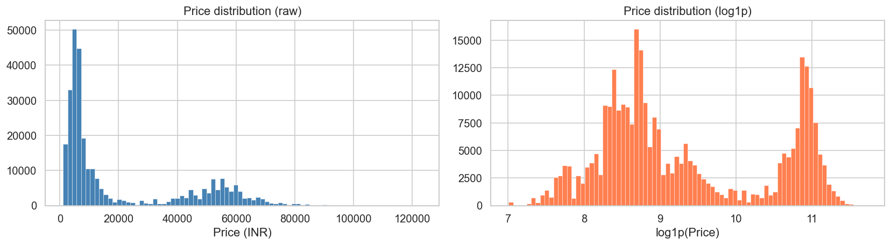

The `log1p` transform fixes this. More importantly, the log-transformed target reveals something critical: **there are two distinct peaks**, not one. This is not noise.

### The bimodal discovery

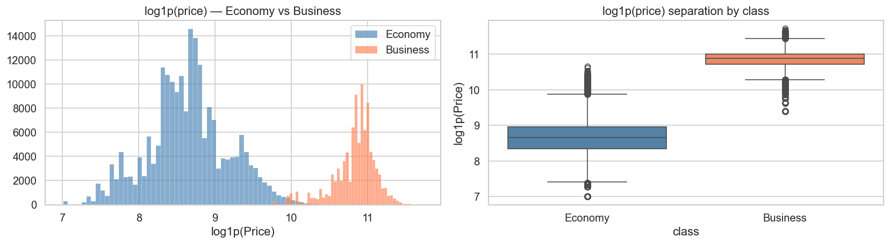

The two humps map exactly onto **Economy** (log ~8–9, avg ₹6,500) and **Business** class (log ~10–11, avg ₹60,000). They are two separate pricing populations living inside one dataset. Every modeling decision downstream flows from this single observation.

- Economy and Business are not on the same price curve
- A model that ignores class will have systematically large residuals at the boundary
- `is_business` becomes the single most important feature in every model

### Price by airline

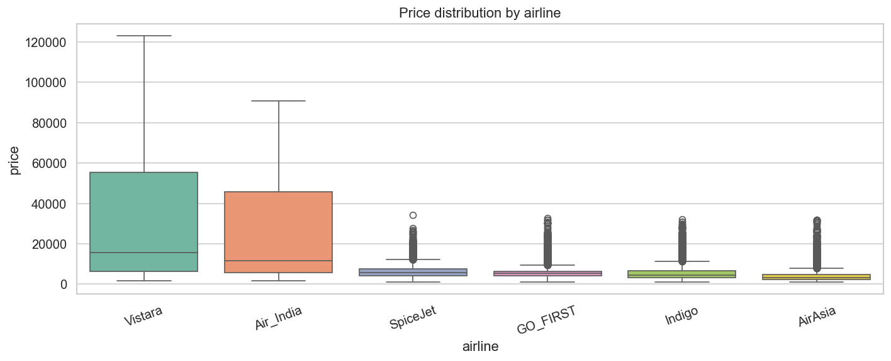

Vistara and Air India command a premium across both classes. SpiceJet and AirAsia cluster at the budget end. The airline feature carries strong signal, especially within Economy.

### Price by stops

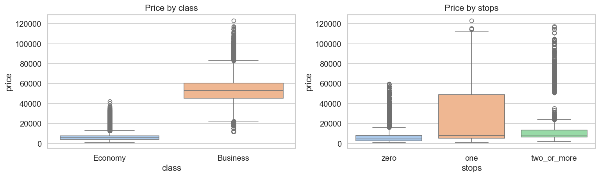

Counterintuitively, more stops do not always mean cheaper — `two_or_more` stop flights can be more expensive than direct on certain routes (long reroutes with premium carriers). This is why `stops` needs to be an ordinal feature, not a binary flag.

### Route heatmap

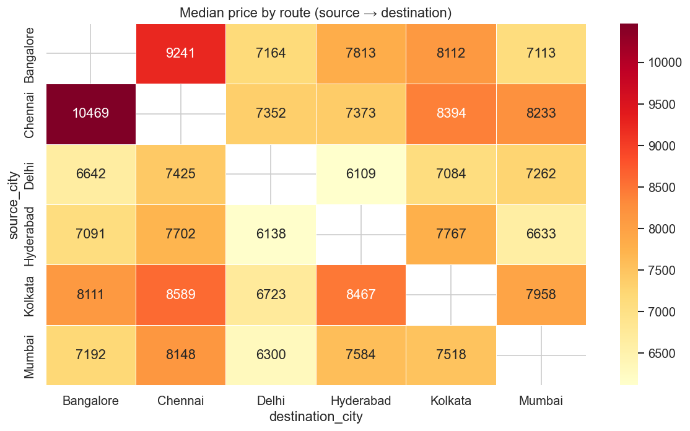

Chennai → Delhi and Bangalore → Delhi are the most expensive corridors. Short-haul routes like Delhi → Mumbai are the cheapest. City-pair combinations have strong independent price signals — both `source_city` and `destination_city` are kept as separate features.

### Booking timing matters

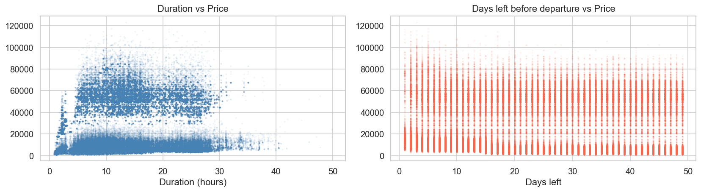

Prices rise sharply in the last 7 days before departure (last-minute premium) and also spike when booking very early (dynamic pricing floor). This non-linear U-shape is why `days_left` as a raw number is weaker than the `urgency_num` bucket feature.

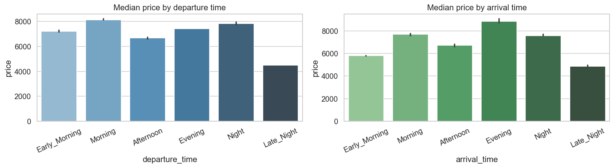

---

## Feature Engineering

All features are derived only from information **available at booking time** — no leakage.

| Feature | Source | Rationale |
|---|---|---|
| `is_business` | `class` column | Binary flag — strongest single predictor |
| `stops_num` | `stops` | Ordinal: zero=0, one=1, two_or_more=2 |
| `dep_time_num` | `departure_time` | Ordinal: Early Morning=0 → Late Night=5 |
| `arr_time_num` | `arrival_time` | Same ordinal encoding |
| `urgency_num` | `days_left` | Buckets: 0–7 days=3, 8–21=2, 22–49=1, 50+=0 |
| `duration_sq` | `duration` | Captures non-linear price growth on long flights |

**Dropped features:**

- `flight` (flight code) — too high cardinality, no generalisation
- `Unnamed: 0` — redundant index column

**Target:** `log1p(price)` — predictions are converted back with `expm1()` for evaluation

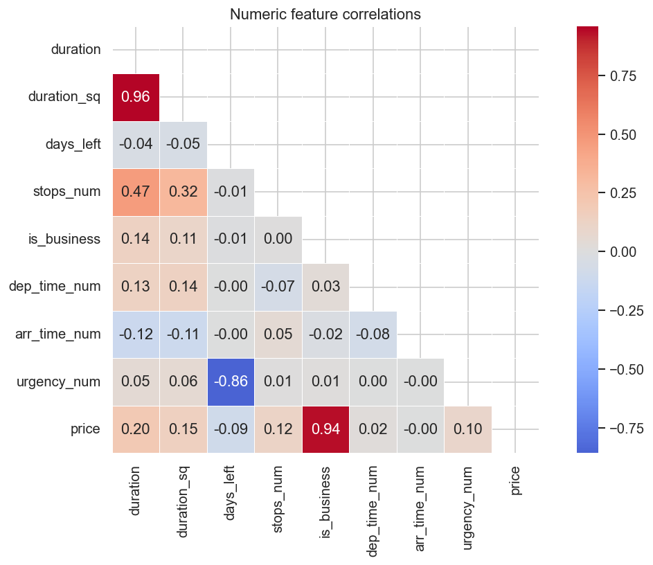

---

## Modeling Journey

### Preprocessing strategy

Two different preprocessors were used — not one — because linear models and tree models have fundamentally different requirements:

| Model family | Categorical encoding | Numeric scaling |
|---|---|---|
| Linear Regression / Ridge | One-Hot Encoding (OHE) | StandardScaler |
| XGBoost | Ordinal Encoding | None (passthrough) |
| ANN | One-Hot Encoding (OHE) | StandardScaler |

### Train / val / test split

```
Train : 240,122 rows (80%)
Val   :  30,015 rows (10%)
Test  :  30,016 rows (10%)
```


### Notebook 01 — EDA + Feature Engineering

Explores all distributions, confirms the bimodal target, engineers 6 leak-free features, and saves `processed_dataset.csv`.

---

### Notebook 02 — Models

#### Linear Regression (baseline linear model)

A regularised linear model with hyperparameter search over `alpha`.

Linear Regression struggle here because:
- The Economy/Business price boundary is a hard non-linearity
- Interaction effects (long Business flights cost disproportionately more) are not captured by additive linear terms

#### XGBoost

300 trees, default parameters. Already stronger than Linear Regression on the first run.

Parameters searched: `n_estimators`, `max_depth`, `learning_rate`, `subsample`, `colsample_bytree`, `min_child_weight`, `reg_alpha`, `reg_lambda`.

#### Feature importance

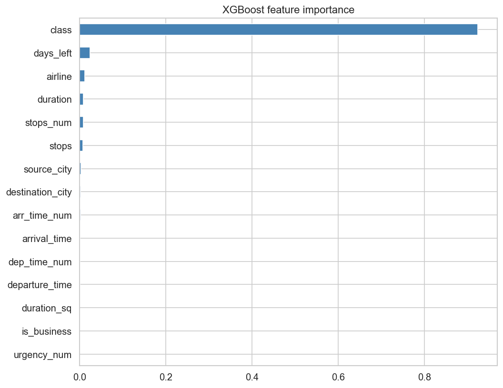

`is_business` is the dominant feature by a wide margin, confirming the bimodal analysis. `duration`, `days_left`, and `airline` are next. The engineered features `urgency_num` and `duration_sq` both contribute meaningfully.

### ANN (Keras + Keras Tuner)
Neural network trained on the same splits with OHE + StandardScaler preprocessing.

#### Architecture search (Keras Tuner RandomSearch, 20 trials)

Hyperparameters tuned:
- Number of layers: 2–5
- Units per layer: 64 / 128 / 256 / 512
- Activation: relu / elu / selu
- Dropout rate: 0.1–0.5 per layer
- Learning rate: 1e-4 to 1e-2 (log scale)
- Batch size: 128 / 256 / 512 / 1024 (manual experiment)

Callbacks: `EarlyStopping(patience=15)` + `ReduceLROnPlateau(factor=0.5, patience=7)`

#### Overfitting check — generalisation gap

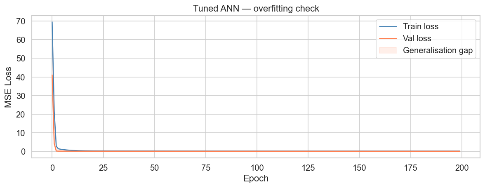


---

## 📈 Results

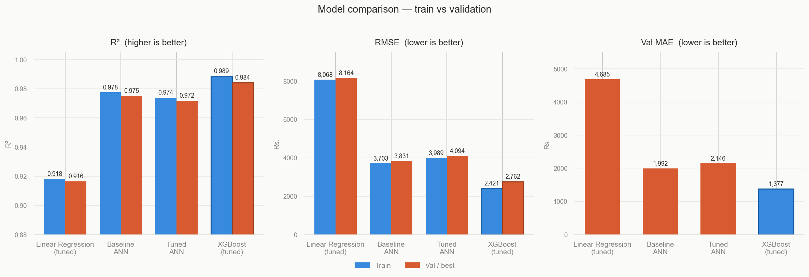

| Model | Train R² | Val R² | Train RMSE | Val RMSE | Val MAE |
|---|---|---|---|---|---|
| Linear Regression (tuned) | 0.9182 | 0.9165 | Rs. 8,068 | Rs. 8,164 | Rs. 4,685 |
| Baseline ANN | 0.9775 | 0.9750 | Rs. 3,703 | Rs. 3,831 | Rs. 1,992 |
| Tuned ANN | 0.9739 | 0.9717 | Rs. 3,989 | Rs. 4,094 | Rs. 2,146 |
| **XGBoost (tuned)** | **0.9885** | **0.9842** | **Rs. 2,421** | **Rs. 2,762** | **Rs. 1,377** |

All metrics computed on held-out validation set. Test set used only once at the very end.

---

## 🏆 Why XGBoost Wins

This is not a coincidence. The nature of this dataset structurally favours tree-based models.

**1. The bimodal target is a hard decision boundary.**
The Economy/Business price gap spans ~2.3 log units. XGBoost's very first split captures this boundary perfectly — it is literally what gradient boosted trees are built for. A neural network has to learn this boundary through many layers of weight updates. XGBoost finds it in one node.

**2. The features are mostly categorical.**
Airline, source city, destination city, departure time, stops — these are all discrete categories. Trees split on exact category membership natively. Neural networks need OHE which creates a sparse high-dimensional input, making gradient flow noisier and training harder.

**3. Interaction effects are explicit in trees, implicit in networks.**
The relationship "Business class + long duration = extremely expensive" is captured as a short path down a tree. A neural network needs to learn this multiplicative interaction through multiple hidden layers.

**4. Dataset size favours XGBoost.**
300,000 rows is large enough for XGBoost to generalise well but not large enough for a deep network to show its theoretical advantage over trees. Neural networks tend to surpass tree models only at millions of rows or on unstructured data (images, text, audio).

**5. No overfitting gap.**
XGBoost tuned shows a train-val R² gap of only 0.0043. The regularisation terms (`reg_alpha`, `reg_lambda`, `subsample`, `colsample_bytree`) found by RandomizedSearch tightly control variance.

## Key Takeaways
- Flight class explains most of the variation in price.
- Feature engineering significantly improves model performance.
- Depending on the data distribution, traditional machine learning models can outperform neural networks.
- Neural networks require larger datasets to outperform boosting models.
---